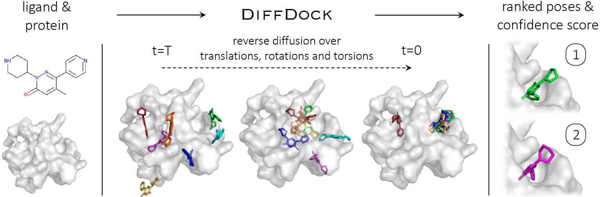

# DiffDock

[DiffDock](https://github.com/gcorso/DiffDock) uses deep learning and is a

>diffusion generative model over the non-Euclidean manifold of ligand poses

See the paper on arXiv: [DiffDock: Diffusion Steps, Twists, and Turns for Molecular Docking](https://arxiv.org/abs/2210.01776#)

## DiffDock overview

